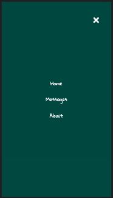

## Project Name and Pirch
- Q'Hubo Messenger
- An application used to let users communicate through written messages

## Project Status
The Projecty is currently in development.

## Project Screen Shot(s)

## Installation and Setup Instructions
Clone down this repository. You will need `node` and `npm` installed globally on your machine.  

Installation:

`npm install`  

To Run Test Suite:  

`npm test`  

To Start Server:

`npm start`  

To Visit App:

`localhost:3000/`  

## Reflection

  - This is a 2 week long project built during my fourth module of Full-Stack Development at Pursuit. The project goal is to utilize the technologies we have learned so far in the course (JS, Node, React, Express, Postgresql)

  - I set out to build a WhatsApp clone to the best of my ability, dure to time constraints I will start the project as a Message Board and then attempt to integrate user authentication and websockets to make it more of a messaging app

  - This project was challenging because I had to be in charge of the whole process from creating the idea; planning out through wireframes, ERDs and user stories; and then development and deployment.

  - The technologies implemented in this project are React, React Router, Express, Node, Postgresql...