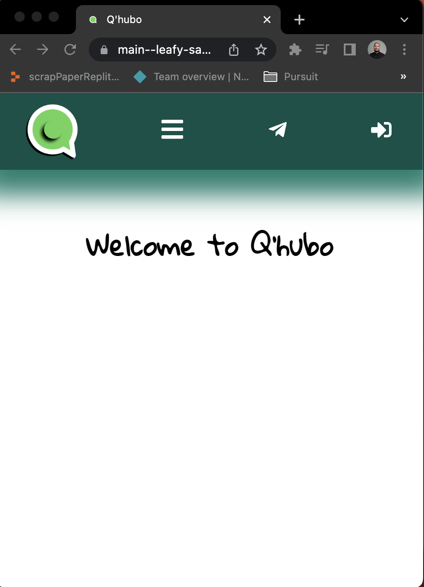
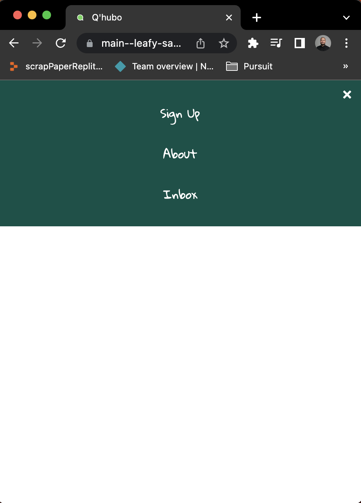
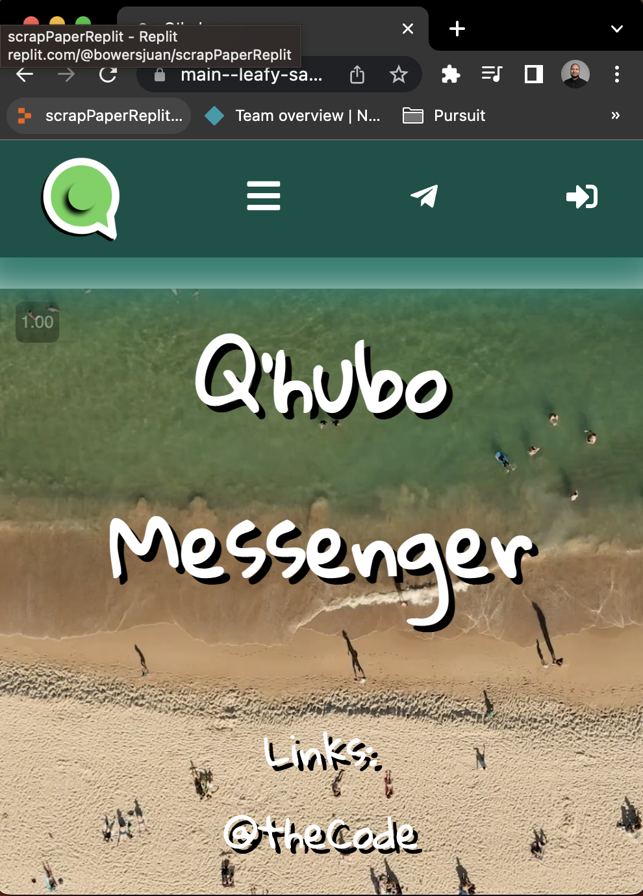
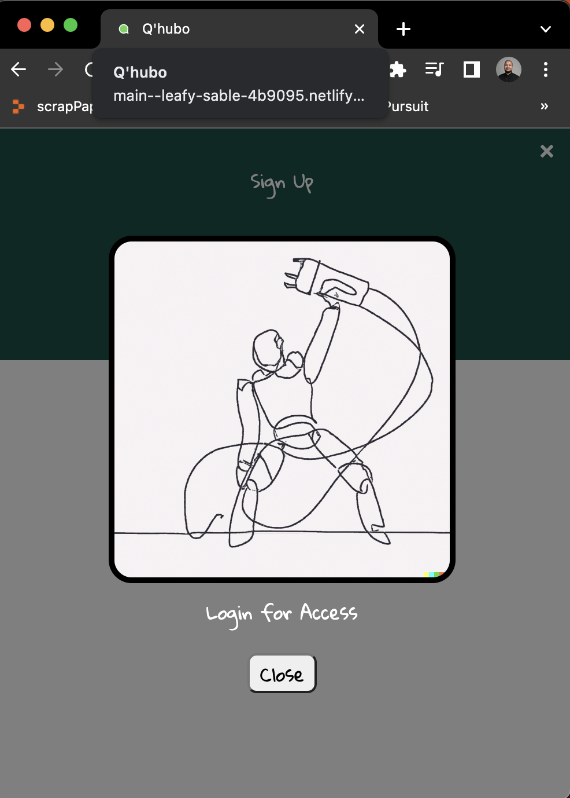
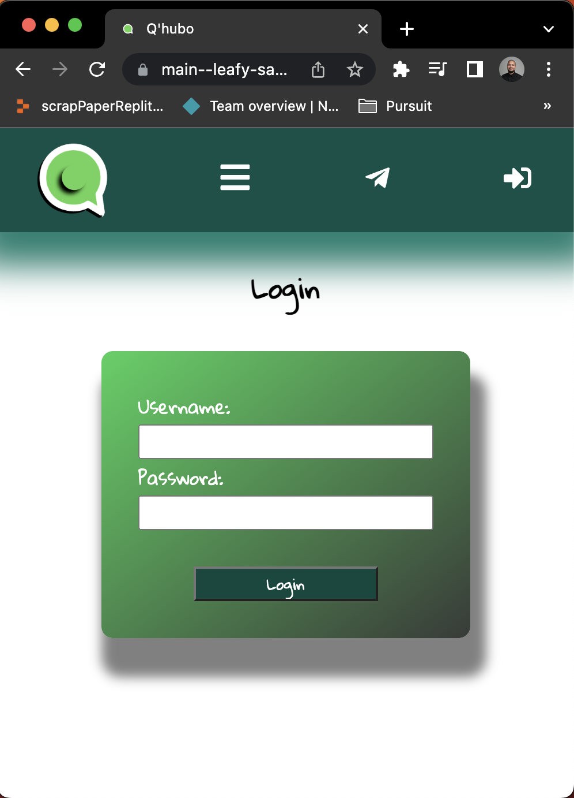
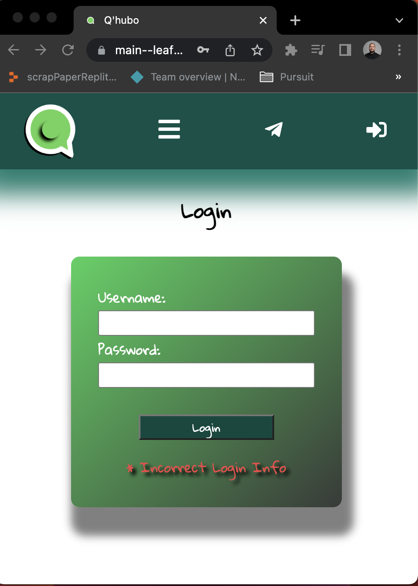
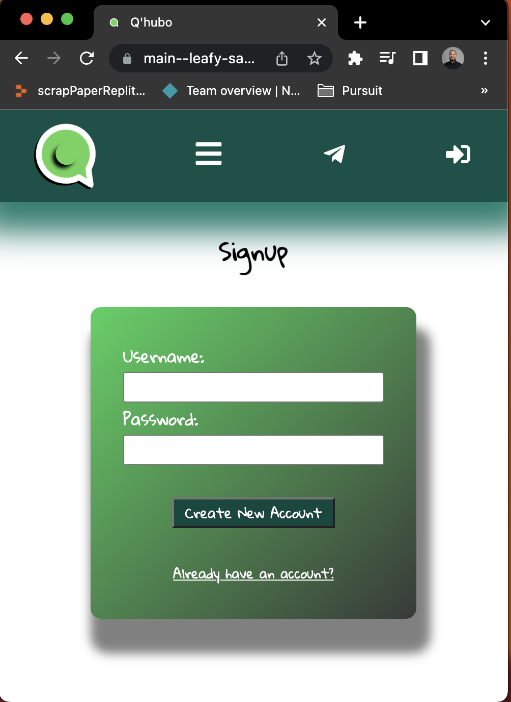
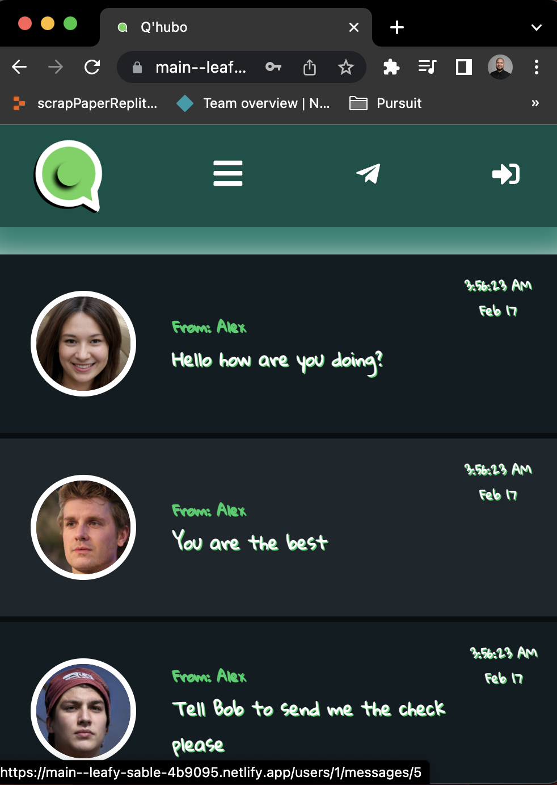
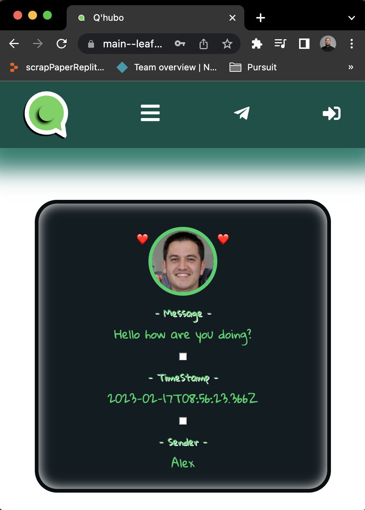
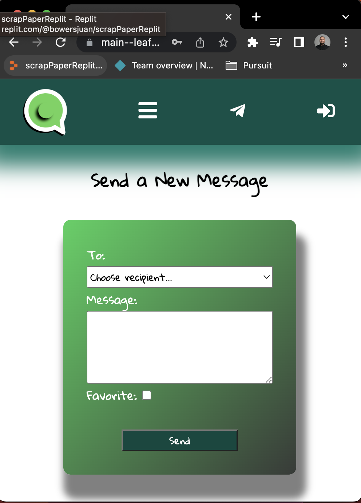

## Project Name and Pitch

- Q'Hubo Messenger
- An application with login access that allows users to send messaages and view/edit them as well.

---

## Repos and Deployment Links

- [Front-End GitHub Repo](https://github.com/bowersjuan/messaging-app-front)
- [Back-End GitHub Repo](https://github.com/bowersjuan/messaging-app-back)
- [Netlify Front](https://main--leafy-sable-4b9095.netlify.app/)
- [Render Back](https://dashboard.render.com/web/srv-cfkndsha6gductg2n4ug)

-[Project Proposal](https://docs.google.com/document/d/1S91fSIYSEpDHsmWSU9ZTZoKXdKIGnt3kZkhmYfrNw80/edit?usp=sharing)

---

## Project Status

The Project is currently in development.

---

## Project Screen Shot(s)

---

## Installation and Setup Instructions

Clone down this repository. You will need `node` and `npm` installed globally on your machine.

Installation:

`npm install`

To Start Server:

`npm start`

To Visit App:

`localhost:3000/`

## Reflection

- This is a 2 week long project built during my fourth module of Full-Stack Development at Pursuit. The project goal is to utilize the technologies we have learned so far in the course (JS, Node, React, Express, Postgresql)

- I set out to build a WhatsApp clone to the best of my ability, dure to time constraints I will start the project as a Message Board and then attempt to integrate user authentication and websockets to make it more of a messaging app

- This project was challenging because I had to be in charge of the whole process from creating the idea; planning out through wireframes, ERDs and user stories; and then development and deployment.

- This project was with a PERN Stack architecture
- Packages: react-router, b-crypt, react-icons, responsive navbar with media-queries
